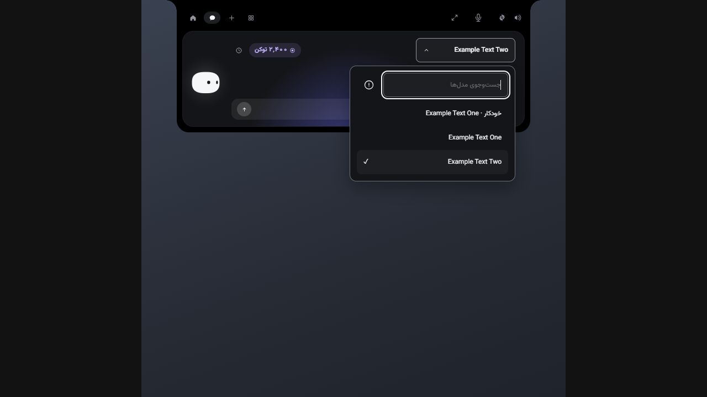

# Coding hooks, voice response and chat model UI — final review

Date: 2026-10-05. Release: 0.1.5. Existing app tokens, Persian RTL typography and compact native island retained. No private microphone/profile/transcript or paid API was used in verification.

## Independent visual review

Three fresh `ui-critic` agents reviewed successive screenshots and relevant code. Root inspected their findings and corrected them before release. Iteration 3 approved shipment with no Critical/Major defects. Its two remaining minor findings (model-trigger hover/active styling and keyboard-focus restoration after async persistence) were also corrected and verified.

| Criterion | Iteration 1 | Iteration 2 | Iteration 3 |
|---|---:|---:|---:|
| Hierarchy | 7 | 9 | 9 |
| Spacing | 7 | 9 | 9 |
| Typography | 8 | 9 | 9 |
| Color / contrast | 8 | 9 | 9 |
| Alignment | 8 | 9 | 9 |
| Interaction states | 6 | 7 | 9 |
| Usability | 6 | 8 | 9 |
| Responsiveness | 7 | 9 | 9 |
| Accessibility | 7 | 8 | 9 |
| Distinctiveness | 7 | 9 | 9 |

Changes from review: truthful configuration detection, clear provider disclosure chevrons, 44px action targets, associated input errors, exact destination and backup labels in hook preview, visible loading/saving/error states, disabled conflicting actions, focus restoration and preserved model-change semantics.

Screenshots used for the final iteration:

- [375px model picker](iteration-3-375-models.png)
- [768px hook error state](iteration-3-768-error.png)
- [1440px hook settings](iteration-3-1440-hooks.png)

Final browser checks verified searchable model options, actual model selection with keyboard, visible success status and returned focus. The palette contains neither Settings nor Feedback; the top settings gear remains. Chat has no advanced cloud voice / computer chips; those controls are present in Settings. Browser preview fixtures intentionally cannot capture audio or run models.

## Root verification

- TypeScript: passed.
- Frontend: 457 tests across 57 files passed.
- Native library: full default suite passed; opt-in runtime/model tests remain separate. MCP library: 20 tests passed.
- Actual pinned Qwen voice-intent harness: passed independently, 14.51 seconds, synthetic Persian commands only.
- Relay: 5 tests passed independently.
- Release / model staging: 29 tests across 3 files passed.
- OpenCode generated plugin: strict documented-SDK fixture and isolated transport/lifecycle/privacy/bounds verification passed independently.
- Three independent UI review iterations completed; all final criteria 9/10.

Release 0.1.5 was built, installed and launched. The installed executable matches the NSIS release, all 518 runtime files passed receipt hashes, the rolling installer matches the versioned installer and the installed hook relay matches the release relay. The installer is 1,641,044,256 bytes; SHA-256 `7f5df40f2d8dbdd873dcae0d78abe655347232202cac9e4acc1a7fae7c84d6ba`.

The current user's Codex hook definitions were installed through the native reviewed-preview/fingerprint path. Foreign configuration was independently compared and preserved; a dated backup was created. Exact upstream trust was not changed. Synthetic SessionStart / SessionEnd events reached the installed application through the installed relay, returned empty stdout and completed in 104ms / 25ms. No permission decision was granted in this smoke check.

Evidence: [release verification](release-verification.json), [hook setup](hook-setup-result.json), [installed relay smoke](installed-relay-smoke.json). The broader implementation/capability limits are in [native hook report](../native-coding-hooks-report.md).

## Practical limits

Hook definition installation is distinct from upstream loading/trust. Codex requires the user to trust the exact hook definitions through `/hooks`. Other hosts may require restarting their session or enabling their documented hooks feature. OpenCode's adapter targets the documented V2 API; no matching installed OpenCode host was available, so host-version compatibility is not claimed. Cline and Zed are explicitly shown as adapter unavailable. Only Claude/Codex expose approval decisions here; all other supported integrations observe events without auto-approving tools.
