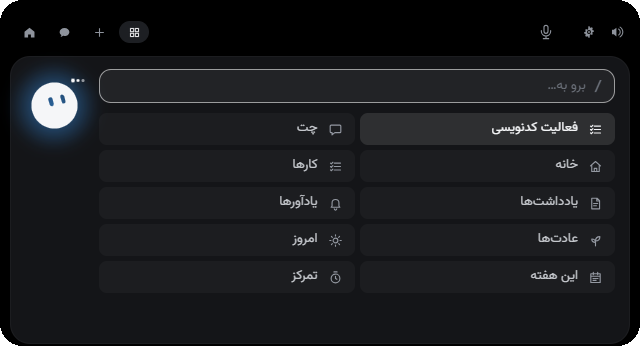
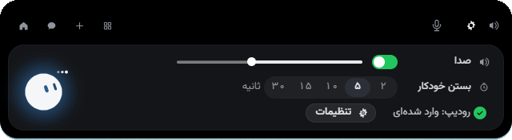
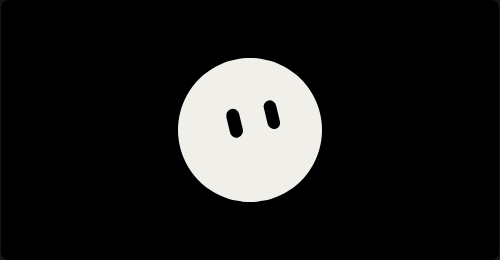
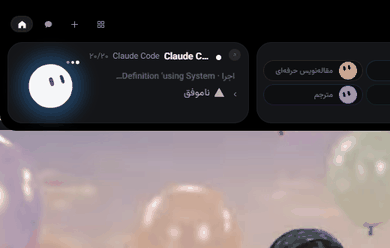

<div align="center">

# رودیپ

**همراه دسکتاپ برای ویندوز و مک**: گفتگو، دستیار صوتی، برنامه‌ریز و تأیید درخواست‌های Claude Code، همیشه یک نگاه با شما فاصله دارد.



</div>

---

## درباره

رودیپ یک جزیرهٔ کوچک بالای صفحه است (در مک، داخل نات). از همان‌جا می‌توانید با رودیپ گفتگو کنید، با دستیار صوتی حرف بزنید، کارها و یادداشت‌هایتان را مدیریت کنید، درخواست‌های دسترسی Claude Code را تأیید کنید و ایجنت‌هایتان را دنبال کنید، بدون اینکه از کاری که دارید انجامش می‌دهید جدا شوید.

## امکانات

### ویندوز

- **جزیره** در لبهٔ بالای صفحه؛ با کشیدن به هر لبهٔ بالا، چپ یا راست جابه‌جا می‌شود. رابط فارسی (راست‌به‌چپ) و انگلیسی.
- **گفتگو با رودیپ**: پاسخ‌های زنده، قالب‌بندی Markdown، تاریخچهٔ گفتگوها، تأیید درخواست‌های ابزار، و پرسیدن دربارهٔ یک فایل با رها کردن آن روی جزیره.
- **دستیار صوتی**: گفتگوی صوتی زنده با GPT-Live از OpenAI، با کلید خودتان. دستیار می‌تواند داخل خود برنامه کار کند (کار، یادداشت، یادآور، تایمر تمرکز، تنظیمات) و هر تغییری منتظر تأیید شماست، با کلیک یا با گفتن «بله» و «نه».
- **برنامه‌ریز**: کار، یادداشت، یادآور، عادت، تایمر تمرکز (پومودورو) و نمای امروز و هفته. با تایپ `/` منوی فرمان باز می‌شود.
- **حافظهٔ محلی**: دستیار ترجیح‌ها و عادت‌های شما را روی همین رایانه به خاطر می‌سپارد. می‌توانید ببینید، پاک کنید یا کلاً خاموشش کنید.
- **Claude Code**: نشست‌ها را زنده ببینید، درخواست‌های دسترسی را از روی جزیره تأیید یا رد کنید، و به پرسش‌هایش همان‌جا جواب دهید. هوک‌ها فقط بعد از بررسی تغییرات نصب می‌شوند.
- **ایجنت‌ها**: ایجنت‌های رودیپ و ایجنت‌های خودتان که با یک ویزارد کمک‌دار ساخته می‌شوند.
- **یکپارچه‌سازی‌ها**: Stripe، GitHub، Vercel، n8n، Resend، Notion و Cal.com.
- **سرور MCP**: `roadeep-mcp` به Claude Code امکان می‌دهد از گفتگو، مدل‌ها و ایجنت‌های رودیپ استفاده کند. تولیدهای پولی بدون تأیید شما انجام نمی‌شوند.
- **کاراکتر متحرک**: کاراکتری که با کد کشیده شده و ۱۴ حالت، حالت‌های چهره، شکل‌ها و رنگ‌ها دارد. حرکتش بر پایهٔ bloub نوشتهٔ Jérémy Perret (MIT) است.
- **میان‌برها**: `Ctrl+Alt+R` گفتگوی جزیره را از هر جایی باز می‌کند. بقیهٔ میان‌برها در تنظیمات ← میان‌برها قابل تنظیم‌اند و به‌صورت پیش‌فرض خاموش‌اند.

### مک

- جزیره در نات، نمایش نشست‌های Claude Code و تأیید درخواست‌ها، گفتگو، رها کردن فایل روی جزیره و یکپارچه‌سازی‌ها.
- برنامه‌ریز، دستیار صوتی و حافظه هنوز روی مک نیستند.

## تصاویر و نمایش

<p align="center">
  
</p>

<p align="center">
  
</p>

<p align="center">
  
</p>

## نصب

- **ویندوز:** نصب‌کنندهٔ آخرین انتشار را از صفحهٔ [انتشارها](../../releases) دانلود کنید، بعد از اینکه منتشر شد. تا آن موقع می‌توانید خودتان از سورس بسازیدش (پایین).
- **مک:** از روی سورس بسازید (پایین). نسخهٔ مک هنوز notarize نشده، پس اولین اجرا باید از *System Settings → Privacy & Security → Open Anyway* انجام شود.

## ساخت از سورس

### ویندوز

نیازمندی‌ها: Rust (نسخهٔ پایدار)، Node.js نسخهٔ ۲۰ به بالا، Visual Studio Build Tools (بخش C++) و WebView2.

```powershell
cd windows
npm install
npm run tauri dev
```

جزئیات نصب‌کننده و نیازمندی‌هایش در [windows/README.md](windows/README.md) و [RELEASING.md](windows/RELEASING.md) آمده است.

### مک

نیازمندی‌ها: macOS نسخهٔ ۱۵ به بالا، Xcode نسخهٔ ۱۶ به بالا و [XcodeGen](https://github.com/yonaskolb/XcodeGen).

```bash
brew install xcodegen
cd NotchBuddy
xcodegen
open NotchBuddy.xcodeproj
```

## راه‌اندازی

۱. از آیکن سینی (ویندوز) یا آیکن نوار منو (مک)، تنظیمات را باز کنید.
۲. با حساب رودیپ وارد شوید.
۳. برای Claude Code گزینهٔ *Install hooks* را بزنید، تغییرات را بررسی کنید و تأیید کنید.
۴. برای صدا، کلید API خودتان را از OpenAI وارد کنید. هزینهٔ گفتگوی صوتی از طرف OpenAI حساب می‌شود.
۵. در صورت نیاز، کلید یکپارچه‌سازی‌ها (Stripe، GitHub و بقیه) را اضافه کنید.

اگر رودیپ بسته یا کند باشد، Claude Code هیچ‌وقت قفل نمی‌شود: هوک بعد از ۳۰۰ میلی‌ثانیه دست می‌کشد.

## حریم خصوصی و امنیت

- تلمتری ندارد و شناسهٔ تبلیغاتی جمع نمی‌کند.
- اطلاعات حساس (نشست رودیپ و کلیدهای API) در Credential Manager ویندوز یا Keychain مک ذخیره می‌شوند، نه در فایل ساده.
- برنامه فقط به سرویس‌هایی وصل می‌شود که خودتان استفاده می‌کنید: رودیپ، OpenAI (فقط وقتی گفتگوی صوتی را شروع می‌کنید)، یکپارچه‌سازی‌هایی که تنظیم کرده‌اید، و GitHub فقط اگر به‌روزرسانی خودکار را فعال کنید.
- حافظه و داده‌های برنامه‌ریز روی رایانهٔ خودتان می‌مانند.
- فایل `settings.json` مربوط به Claude Code هیچ‌وقت بی‌صدا بازنویسی نمی‌شود: نسخهٔ پشتیبان با تاریخ گرفته می‌شود و تغییرات را قبلش می‌بینید.

## وضعیت فعلی

- **ویندوز** کامل‌ترین نسخه است. صدا، برنامه‌ریز، حافظه و کاراکتر جدید فقط در ویندوز هستند.
- **مک** جزیرهٔ داخل نات، نشست‌ها و تأیید Claude Code، گفتگو و یکپارچه‌سازی‌ها را دارد.
- بعضی فایل‌های این مخزن (صداها، آیکون‌ها و پوشهٔ `design/`) از پروژهٔ اصلی‌اند که نویسندهٔ اصلی رزروشان کرده است، و قبل از انتشار عمومی جایگزین می‌شوند. کاراکتر نسخهٔ مک هم هنوز همان طراحی اصلی است.

## مجوز

این مخزن سه نوع محتوا دارد:

۱. **کد و محتوای رودیپ**: اختصاصی. متن کامل در [LICENSE-ROADEEP.md](LICENSE-ROADEEP.md).
۲. **کد پروژهٔ متن‌باز اصلی** (© ۲۰۲۶ Louis Raillé): MIT. متن کامل در [LICENSE](LICENSE) است و اعلان آن سر جایش می‌ماند.
۳. **کاراکتر، آیکون‌ها و صداهای پروژهٔ اصلی**: رزروشده توسط نویسندهٔ اصلی. ببینید [LICENSE-ASSETS.md](LICENSE-ASSETS.md).

اجزای شخص ثالث مجوز خودشان را دارند: حرکت کاراکتر در `windows/src/character/bloub/` (MIT، © Jérémy Perret) و زمان‌اجراهای مدل‌های محلی که در `windows/scripts/local-ai-licenses/` فهرست شده‌اند.

## سپاس‌گزاری

بر پایهٔ پروژهٔ متن‌باز Louis Raillé (MIT) ساخته شده است. رودیپ توسط Damyar-Roadeep منتشر می‌شود.

## تماس

[roadeep.com](https://roadeep.com)
